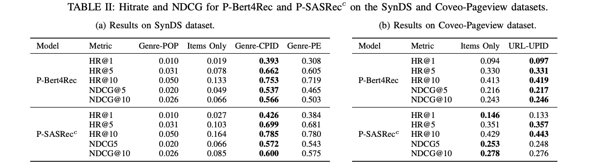
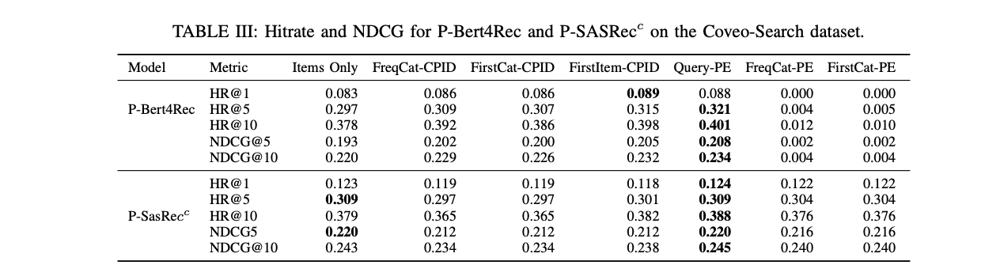

# ASME - [A] [S]equential Recommendation [M]odel [E]valuator

# Getting Started

The configuration files for "Enhancing Sequential Next-Item Prediction through Modelling Non-Item Pages in Transformer-Based
Recommender Systems" can be found under non-items-paper-configs for the public datasets.

To train, install the dependencies as described below. Add the src folder to your pythonpath and run the main, e.g.
```shell 
poetry run python -m plp_paper.plp_main train config_file
```
You can train a model with 
```shell 
train config_file
```
and evaluate with 
```shell
evaluate --config-file config_file --checkpoint-file checkpoint
```
The ML-20m dataset will be downloaded automatically, the Coveo dataset (https://github.com/coveooss/SIGIR-ecom-data-challenge) has to be downloaded manually. To (re-)generate the coveo files for the first run, set  ```perform_convert_to_csv: true``` in the config. 

## Experiments
The config files for "ml-20m" are split into the folders "ml-20m" for the models using items only, and "ml-20m-extended" for models using artificial non-iten pages.
For the Coveo-Pageview dataset you can find the configs for items-only in "coveo-nd" and with non-item pages in "coveo-nd-pageview".

For the Coveo-Search dataset you can find the configs for items-only in "coveo-slnd" and with non-item pages in "coveo-slnd-search".


## Install Locally
* Install [Poetry](https://python-poetry.org)
* Clone the repository
* Build the development virtual environment: `poetry install`
* Enter the virtual environment: `poetry shell`

## Docker
The docker file in /k8/dev can be used to create an image which automatically pulls and updates the specified branch from gitlab and uses poetry to execute asme.

### Environment Variables
* PREPARE_SCRIPT:
  If set the script will be executed before the framework command is run. This is useful for copying data to a faster drive
* GIT_TOKEN:
  Token used to checkout the repository
* REPO_USER:
  User used to checkout the repository
* REPO_BRANCH:
  Branch to checkout
* PROJECT_DIR:
  A writeable path within the container, that will be used to store the repository

The development container does not come with a preinstalled version of the framework. Instead, the entrypoint will clone the specified branch and setup an environment using poetry. Your command will be executed inside this environment.

##### Generate Gitlab access token
Even though the password is supplied via an environment variable that can be populated by a kubernetes secret, you probably don't want to share it with the admins. Lucky for us, we can also generate a gitlab access token for that purpose.

1. Go to your Profile and select Settings->Access Tokens
2. Give it a name, e.g. `k8s`
3. Select `read_repository`
4. Save the final token, because it won't be accessible afterwards

##### Create kubernetes secret

```
kubectl -n <namespace> create secret generic gitlab-token --from-literal=token=xxx
```

